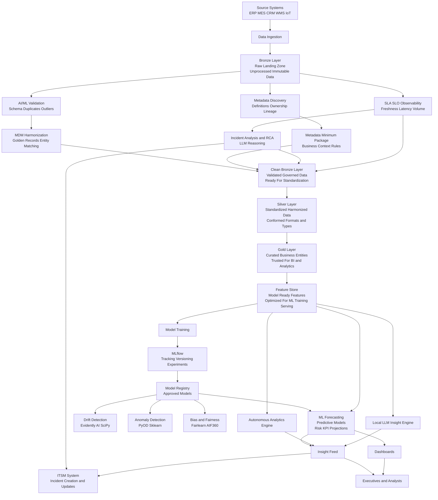

# ai-augmented-architecture

# AI-Augmented Data & Intelligence Architecture

## Architecture Mermaid Diagram

This architecture is not a replacement for the classical data pipeline — it extends it with AI, ML, and deep-learning components that improve the entire lifecycle of data-driven decision making.
Rather than adding only generative AI at the end of the process, this enhanced architecture strengthens the foundation by applying intelligence from the moment data enters the system. It uses machine learning to validate data quality, detect anomalies, identify schema drift, discover metadata, and harmonize master data — ensuring that every downstream insight is based on clean, reliable, and trustworthy information.

On top of this stronger foundation, the architecture incorporates forecasting models, anomaly detection algorithms, autonomous analytics, and generative AI narrative engines that explain trends, detect risks, and highlight root causes. These additions transform a traditional, reactive dashboard ecosystem into a proactive intelligence layer where insights are not only visualized but also predicted, explained, and routed to the right people through ITSM workflows.

In short: this extended architecture keeps everything that works in classical BI, but adds intelligence at every step — improving data quality, accelerating decision-making, increasing operational predictability, and reducing the manual effort required to investigate issues or understand performance changes.

This architecture elevates BI from reporting the past to anticipating the future — while still maintaining full control, governance, and operational accountability.
